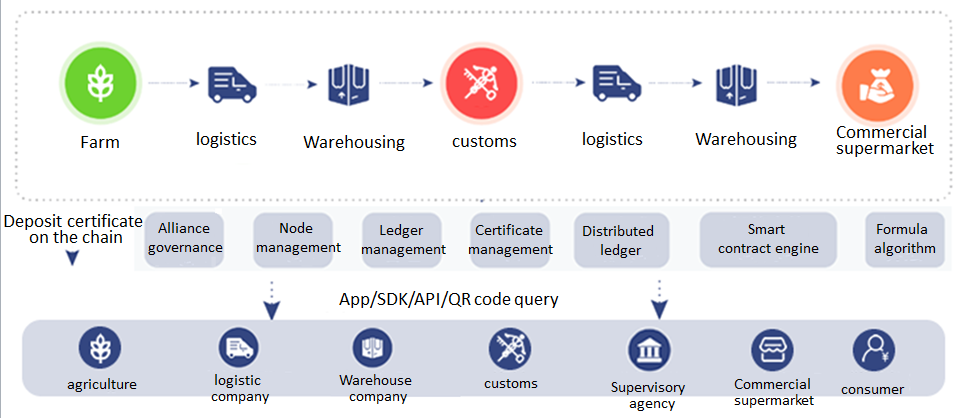
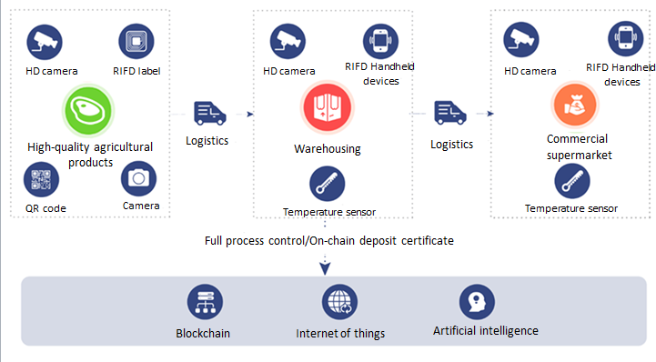

# Tracing solution

  
Build a trusted traceability platform for intelligent agricultural products, and store all agricultural products from planting, picking, transportation, customs declaration, food quarantine, listing and sales information on the chain with the help of blockchain distributed accounts. Open the whole process data query to realize the whole traceability and trustworthy query of agricultural products.  

  
Through the configuration of intelligent Internet of things devices, such as HD camera HDTV, thermal imaging sensor, RFID tag, QR code, etc., it can realize the automatic collection of object data for high-quality agricultural products, minimize human intervention, and improve the efficiency and accuracy of agricultural products logistics tracking. 
